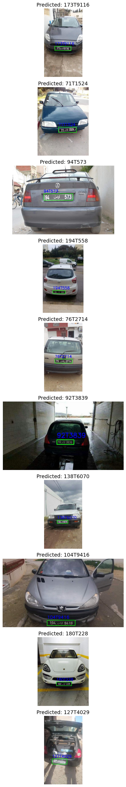

# License Plate Recognition (LPR) Project

## Project Overview

This project implements an end-to-end License Plate Recognition (LPR) system, consisting of two main tasks:

- **License Plate Detection** – Detects and localizes license plates in vehicle images using YOLOv5, with bounding box annotations mapped from CSV files.  
- **License Plate Recognition** – Recognizes characters from cropped license plate images using a CNN + BiLSTM + CTC deep learning model.  

The system is trained on a custom dataset where bounding boxes were provided in CSV annotation files and mapped to the corresponding images.

---

## Folder Structure

```text
.
├── data/                                    # Contains datasets for detection and recognition
│   ├── license_plates_detection_train/       # Vehicle images for detection
│   ├── license_plates_recognition_train/     # Cropped license plate images with text labels
│   ├── test/                                # Images for evaluation/testing
│   ├── Licplatesdetection_train.csv         # Detection annotations with bounding box info
│   └── Licplatesrecoginition_train.csv       # Recognition dataset with plate text labels
├── output/                                  # Example output images
│   └── image1.png                           # Detection + recognition example
├── License_Plate_Recongintion.ipynb         # Jupyter Notebook with full implementation
├── requirements.txt                         # Python dependencies
├── .gitignore
└── README.md                              

```
---


## Dataset

### 1. Detection Dataset

- **Images:** `data/license_plate_detection_train/`  
- **Annotations:** `data/Licplatesdetection_train.csv`  

**CSV format:**

| img_id | ymin | xmin | ymax | xmax |
|--------|------|------|------|------|
| 1.jpg  | 276  | 94   | 326  | 169  |
| 10.jpg | 311  | 395  | 344  | 444  |
| 100.jpg| 406  | 263  | 450  | 434  |

- `img_id` – Image filename  
- `ymin, xmin, ymax, xmax` – Bounding box coordinates of the license plate  

> Bounding boxes are mapped programmatically to each image for training YOLOv5.

---

### 2. Recognition Dataset

- **Images:** `data/license_plate_recognition_train/`  
- **Annotations:** `data/Licpatesrecoginition_train.csv`  

**CSV format:**

| img_id | text     |
|--------|----------|
| 0.jpg  | 117T3989 |
| 1.jpg  | 128T8086 |
| 10.jpg | 94T3458  |

- `img_id` – Cropped license plate image filename  
- `text` – License plate number  

> These labels are used to train the CNN + BiLSTM + CTC model for sequence recognition.

---

### 3. Test Set

- Images in `data/test/` are used for evaluating detection and recognition performance.

---

## Example Output

  

> The image shows multiple vehicles with bounding boxes and predicted license plate text.

---

## Implementation

The pipeline is implemented in Python using popular deep learning libraries:

- **Detection:** YOLOv5 for license plate localization based on CSV annotations.  
- **Recognition:** CNN + BiLSTM + CTC for sequence-based character recognition.  

**Steps:**

1. **Data Preprocessing** – Read images and CSV annotations, resize, normalize, and prepare datasets.  
2. **License Plate Detection** – Train and validate YOLOv5 model to localize plates.  
3. **Character Recognition** – Train CNN + BiLSTM + CTC model on cropped license plate images.  
4. **Evaluation** – Test the model on the test set for detection and recognition accuracy.  

---

## Requirements

All required Python packages are listed in `requirements.txt`. Install using:

```bash
pip install -r requirements.txt
```

---

## How to Run

1. Open `License_Plate_Recongintion.ipynb`.
2. Execute the notebook cells sequentially to:
   - Map bounding boxes from CSV files
   - Train the YOLOv5 detection model
   - Train the CNN + BiLSTM + CTC recognition model
   - Recognize license plate text from test images
3. Update dataset paths in the notebook if required.


